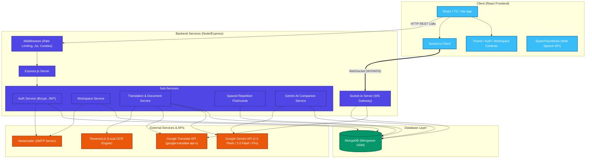

# 🌐 LinguaLink

A real-time, premium multilingual communication and collaboration platform. LinguaLink breaks language barriers dynamically by orchestrating AI-powered translations, document OCR, spaced-repetition learning, and collaborative workspaces.

---

## 📐 System Architecture

LinguaLink is built on a modern decoupled client-server architecture. The frontend is a responsive React client, and the backend is a Node.js/Express service that manages real-time WebSockets, handles document processing pipelines, and integrates with the Google Gemini API.



---

## ✨ Features

### 1. Real-Time Chat & Workspace Auto-Translation
- **WebSocket Synchronization**: Powered by `Socket.io` to provide instantaneous messaging.
- **Multilingual Parallel Translation**: When a message is sent, the server detects the sender's source language and translates it into **15 supported languages** in parallel, storing all translations directly in the database.
- **Dynamic Localized Delivery**: Messages are broadcasted to rooms (`workspace_${workspaceId}`) or DMs (`user_${userId}`). The client automatically displays the message version corresponding to the user's preferred language.

### 2. Document OCR & Translation
- **Multiple Document Types**: Supports `.txt` text files and scanned `.pdf` documents.
- **OCR Pipeline**: PDF files are parsed using `pdf-parse`. If text is non-extractable (e.g. scanned images), the system converts the first 3 pages to PNG images via `pdf-to-png-converter` and runs `Tesseract.js` OCR locally.
- **Context-Aware AI Translation**: Translations are performed using Google Gemini AI (`gemini-2.0-flash`) to preserve complex nuances and formats, with Google Translate as a robust fallback.

### 3. Spaced Repetition Flashcard Trainer
- **Vocabulary Archiving**: Users can mark translations from their history as "favorites".
- **SM-2 Inspired Algorithm**: Calculates review dates and ease factors based on user performance.
  - Correct responses increase the review interval from 1 day up to 730 days.
  - Incorrect responses reset the interval to 10 minutes and recalculate ease factors.
- **Deck Metrics**: Track total, due, and mastered cards on a dashboard interface.

### 4. AI Translation Companion & Chat
- **AI Chatbot**: Real-time interface to ask translation, vocabulary, and grammar questions to Gemini AI.
- **Intelligent Translation Explainer**: Explains language nuances, cultural context, and grammar differences of any translation pair.
- **Model Fallbacks**: Gracefully cascades calls across Gemini models (`gemini-1.5-flash` ➔ `gemini-1.5-flash-latest` ➔ `gemini-pro` ➔ `gemini-1.0-pro`) for maximum availability.

### 5. Multi-User Collaboration Workspaces
- **Workspaces**: Dynamic workspace creation, owner capabilities, and real-time member lists (online/offline tracking).
- **Email Invites**: Invite new or existing users using dynamic email templates sent via SMTP (`nodemailer`).

### 6. Additional Modes & Helpers
- **Bilingual Face-to-Face Chat**: Interactive UI designed for two local users conversing side-by-side with immediate auto-translated splits.
- **Voice Transcription (STT)**: Submits audio recording buffers directly to the Gemini API (`gemini-1.5-flash`) for multi-language voice-to-text.
- **Voice Synthesis (TTS)**: Built-in frontend text-to-speech utilizing the browser's `SpeechSynthesis` API.

---

## 🛠️ Tech Stack & Dependencies

### Frontend:
- **Core**: React 18 + TypeScript + Vite
- **Styling & Animations**: TailwindCSS, Lucide React (Icons), Framer Motion (Transitions)
- **State & Routing**: React Router DOM (v6), Context API (`AuthContext`, `ThemeContext`, `WorkspaceContext`)
- **Networking & WebSockets**: Axios (HTTP client), Socket.io Client

### Backend:
- **Core**: Node.js + Express
- **Database**: MongoDB + Mongoose ODM
- **Real-time Gateway**: Socket.io
- **AI Integration**: `@google/generative-ai` & native Gemini API calls
- **NLP & Document Utilities**: `google-translate-api-x`, `tesseract.js`, `pdf-parse`, `pdf-to-png-converter`, `multer` (in-memory buffer storage)
- **Security & Validation**: `bcrypt` (password hashing), `joi` (request schema validation), `express-rate-limit` (anti-abuse headers), `cookie-parser` (secure auth cookies)
- **Communication**: `nodemailer` (SMTP)

---

## 🗄️ Database Schemas (Mongoose)

- **User**: Details users' name, email, credentials, and `preferredLanguage` setting.
- **Workspace**: Maps workspace structures, names, owner emails, and active member lists.
- **Message**: Stores the sender, recipient (optional for DMs), `originalContent`, and the complete translated versions map (`translations: { English: "...", Spanish: "...", ... }`).
- **TranslationHistory**: Tracks text conversions, including favorites and spaced repetition metadata (`nextReviewDate`, `repetitionLevel`, `easeFactor`) for flashcard calculations.
- **BilingualChat**: Stores face-to-face local messaging records between two participants.
- **AIChat**: Handles user conversations with the Gemini AI chatbot assistant.
- **PasswordReset**: Logs secure tokens, expiry intervals, and verification states.

---

## 🌐 Supported Languages (15)

LinguaLink provides full real-time auto-translation and OCR parsing across:
- English (`en`), Spanish (`es`), French (`fr`), German (`de`), Italian (`it`)
- Portuguese (`pt`), Russian (`ru`), Japanese (`ja`), Chinese (`zh-CN`), Hindi (`hi`)
- Arabic (`ar`), Korean (`ko`), Turkish (`tr`), Vietnamese (`vi`), Thai (`th`)

---

## 🚀 Quick Start

### Prerequisites
- **Node.js**: version 18 or higher
- **MongoDB**: a running local or Atlas cluster instance
- **Google Gemini API Key**: optional but required for AI companion features

### ⚙️ Environment Configurations

Create a `.env` file inside the `/Backend` directory:

```env
# Database Settings (Required)
MONGO_URL=mongodb://localhost:27017/lingualink

# AI Services (Optional, unlocks Gemini chatbot, document translations, voice STT)
GEMINI_API_KEY=your_gemini_api_key_here

# Mailer Settings (Optional, unlocks email invites and reset links)
EMAIL_USER=your_email@gmail.com
EMAIL_PASS=your_gmail_app_password

# Authentication (Optional, fallback provided)
JWT_SECRET=your_jwt_secret_token
```

### 🏃 Running Locally

#### 1. Start Backend Server
```bash
cd Backend
npm install
npm start
```
The server will run on `http://localhost:8000`.

#### 2. Start Frontend Dev Client
```bash
cd frontend
npm install
npm run dev
```
The application will run on `http://localhost:5173`.

---

## 🧪 Testing Suite

Jest and Supertest handle validation of routing specifications, schemas, and configurations.

Run backend unit tests:
```bash
cd Backend
npm test
```

---

## 📦 Deployment Guide

### Frontend Deployment (Firebase Hosting)
Vite builds optimized SPA bundles placed in `frontend/dist` which deploy directly to Firebase.

```bash
cd frontend
npm run build
firebase deploy --only hosting
```

### Backend Deployment (Google Cloud Run)
The backend service compiles with the `/Backend/Dockerfile` using Node 20. Run the following command to deploy directly into GCR:

```bash
cd Backend
gcloud run deploy lingualink-backend --source . --region us-central1 --allow-unauthenticated
```

---

## 📄 License

This project is licensed under the MIT License.
